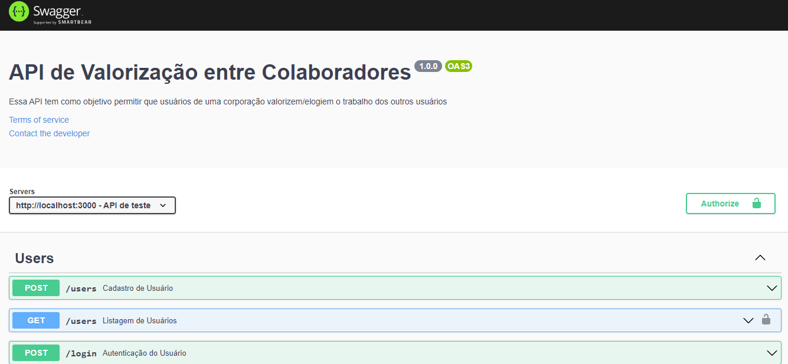

# Valoriza

<h1 name="sobre">ℹ Sobre o Projeto</h1>
Uma API em NodeJS que permite usuários de uma corporação valorizar/elogiar o trabalho dos outros usuários 🎯

- ### **Pré-requisitos**

  - É **necessário** possuir o **[Node.js](https://nodejs.org/en/)** instalado no computador
  - É **necessário** possuir o **[Git](https://git-scm.com/)** instalado e configurado no computador
  - Também, é **preciso** ter um gerenciador de pacotes seja o **[NPM](https://www.npmjs.com/)** ou **[Yarn](https://yarnpkg.com/)**.

```bash
# Clone Repository
$ git clone https://github.com/IanaCris/valoriza.git
```

<h3 name='api'>📦 Instala as Dependências</h3><br>

```bash
# Vá até a pasta
$ cd valoriza
# Instale as dependências
$ yarn # ou npm install
```
<h3 name='api'>📦 Criar a base de dados</h3><br>

```bash
# Cria as tabelas no banco de dados
$ yarn typeorm migration:run
```

<h3 name='api'>📦 Executar a aplicação</h3><br>

```bash
# Executa a aplicação
$ yarn dev
```

<h1 name="preview">:bookmark_tabs: Documentação das rotas</h1>
<h3>Documentação com Swagger UI</h3>
<h5>Depois de executada a aplicação, acessar na url: http://localhost:3000/api-docs</h5>



## 📌 Regras

- Cadastro de usuário

- [x] Não é permitido cadastrar mais de um usuário com o mesmo em-mail

- [x] Não é permitido cadastrar usuário sem e-mail

- Cadastro de TAG

- [x] Não é permitido cadastrar tag sem nome

- [x] Não é permitido cadastrar mais de uma tag com o mesmo nome

- [x] Não é permitido o cadastro por usuários que não sejam administradores

- Cadastro de elogios

- [x] Não é permitido um usuário cadastrar um elogio para si

- [x] Não é permitido cadastrar elogios para usuários inválidos

- [x] O usuário precisar estar autenticado na aplicação
   
## 💻 Tecnologias 
* [Node.js](https://nodejs.org/en/) - Baixe a versão recomendada LTS.
* [Yarn](https://classic.yarnpkg.com/en/docs/install/#windows-stable) - Gerenciador de pacotes, similar ao npm do Node.js.
* [Express](https://expressjs.com/pt-br/) - Framework para desenvolver back-end com Node.js.
* [TypeScript](https://www.typescriptlang.org/) - É JavaScript com tipagem de dados e recursos adicionais, voltado ao lado servidor.
* [Beekeeper](https://www.beekeeperstudio.io/) - Gerenciador de Banco de Dados e editor de código SQL.
* [Insomnia](https://insomnia.rest/) - É um programa que testa as requisições de uma API(GET, POST, PUT, DELETE, PATCH, etc).
* [Swagger](https://swagger.io/) - É uma linguagem de descrição de interface para descrever APIs RESTful expressas usando JSON.
